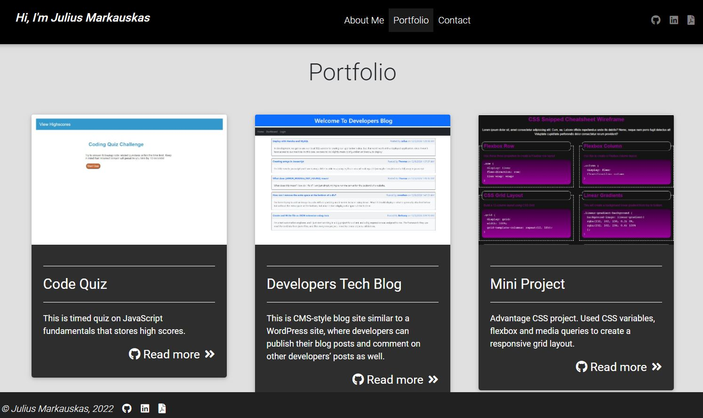
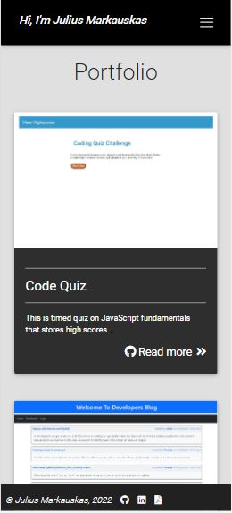

# Portfolio

 [](https://opensource.org/licenses/MIT)

  ## Table of contents
  - [Description](#description)
  - [Installation instructions](#installation-instructions)
  - [Usage information](#usage-information)
  - [License](#license)
  - [Questions](#questions)


  ## Description

A portfolio of work: About Me, Resume, LinkedIn, and GitHub. 

Latest projects. Contact information.

This portfolio is created using React.

#### User Story

```md
AS AN employer looking for candidates with experience building single-page applications
I WANT to view a potential employee's deployed React portfolio of work samples
SO THAT I can assess whether they're a good candidate for an open position
```

  This application is deploy to GitHub Pages.  [Portfolio](https://juliusm9791.github.io/Portfolio_React/)

  Desktop version of website
  
  

  Mobile version of website

  


  #### For this project the following technologies were used:
  * Nodejs
  * bootstrap
  * react
  * mdbreact


  ## Installation instructions

  For dependancies run following comand:

  ```npm i```

  ## Usage information

   ``npm start``

  ## License

  [](https://opensource.org/licenses/MIT)

  Usage is provided under [The MIT License](https://opensource.org/licenses/MIT). See LICENSE for the full details.

  ## Questions

  To reach me with additional questions

  GitHub: [Juliusm9791](https://github.com/Juliusm9791)

  Email: juliusm9791@gmail.com


